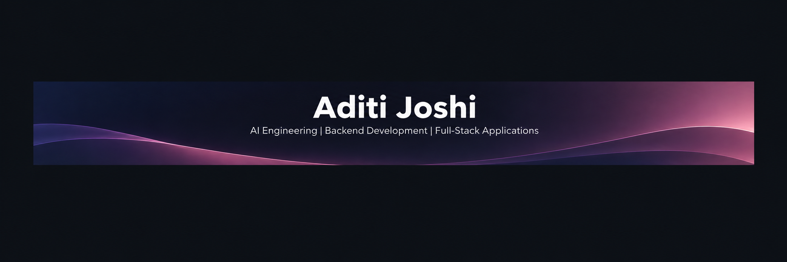

 

---

## 👩🏻‍💻 Profile

I'm a final-year B.Tech student at IIIT Naya Raipur, passionate about building AI-powered products, developing intelligent agents, and creating scalable backend and full-stack applications. I enjoy exploring Generative AI, LLMs, and modern technologies to turn ideas into practical, real-world solutions.

---

## 🚀 Featured Projects

### 🎙️ Voice AI Agent

An AI-powered voice assistant focused on conversational interactions and intelligent responses.

**Tech Stack:** Python · LLMs · Voice AI

[🔗 View Repository](https://github.com/aJ23101/voice-ai-receptionist)

---

### 🎬 Cinefolio

A movie discovery and tracking platform for exploring films, managing watchlists, and keeping track of your movie journey.

**Tech Stack:** React · TypeScript · Tailwind CSS · Supabase

[🔗 View Repository](https://github.com/aJ23101/Cinefolio)

---

### 🤖 AI Task Manager

An AI-powered productivity application focused on smarter task planning, organization, and workflow management.

**Tech Stack:** AI · APIs · Backend Development

[🔗 View Repository](https://github.com/aJ23101)

---

### 🔎 QueryPilot AI

AI-powered data analysis assistant to upload CSV/Excel datasets, chat with data using natural language, generate SQL queries, and uncover insights.

**Tech Stack:** Python · Streamlit · SQLite ·  Pandas · LLMs 

[🔗 View Repository](https://github.com/aJ23101/Task-Mind-AI)

---

## 🛠️ Technical Stack

| Category | Technologies |
|:---|:---|
| **Languages** | Python, C++, JavaScript, SQL |
| **Frontend** | React, TypeScript, Tailwind CSS, HTML, CSS |
| **Backend** | FastAPI, Node.js, Express, REST APIs |
| **AI & Generative AI** | LLMs, Generative AI, LangChain, RAG, AI Agents |
| **Data Analysis** | Pandas, NumPy, Matplotlib, Seaborn, Streamlit |
| **Databases** | PostgreSQL, SQLite, Supabase, MongoDB |
| **Tools & Platforms** | Git, GitHub, Docker, VS Code, Jupyter Notebook |

---

### ✦ Turning curiosity into code, and ideas into impact. ✦

*Always curious. Forever building.* 🚀

**Thanks for stopping by!** ✨

<i>Let's build something meaningful together.</i>

